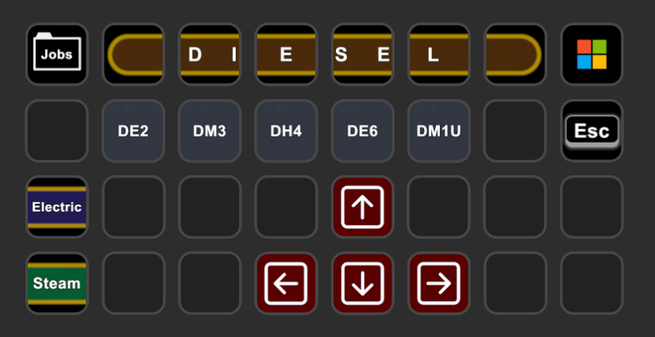
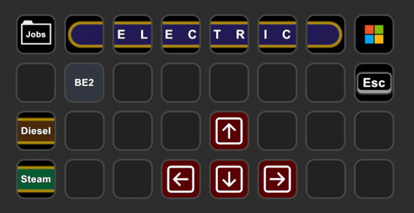
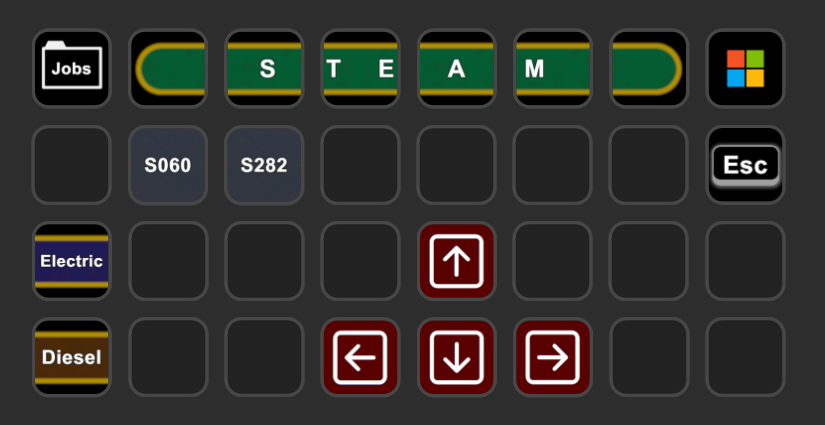

[&laquo; back](../README.md)

# Derail Valley

`Stream Deck XL` profiles for the game `Derail Valley`.

## Table of contents

- [About these profiles](#about-these-profiles)
- Profile descriptions:
    - [Diesel](#diesel)
        - [DE2](#de2)
        - DM3 (coming soon)
        - DH4 (coming soon)
        - [DE6](#de6)
    - [Electric](#electric)
        - BE2 (in progress)
    - [Steam](#steam)
        - S060 (coming soon)
        - S282 (coming soon)
- [Download](#download)

## About these profiles

### Philosophy

The setup is split up into 3 distinct Stream Deck profiles. However, they are designed to be installed together to allow you to easily switch between the three fuel type profiles.

#### Why so much repetition?

Although there is a HUGE amount of similarity between all the profiles and locomotive specific pages, there is a very good reason. I only wanted access to the controls that the current locomotive being driven had available.

Just to name one example, the `DE6` has dynamic braking, whereas the `DE2` does not, so I didn't want the `DE2` pages to have the dynamic break controls available, as such, they are blanked out.

#### Why is there a page for shunting and another for main line running?

The reason for having 2 pages per locomotive is because I wanted to optimise the controls for the operation in progress (shunting vs. main line running). This is because, while driving between stations there is no need, for example, to have access to the reverser and toggling it accidentally while in motion has serious consequences! In the rare occasion that you do need to access the reverser, it's only 1 extra button press away since switching between the two modes of operation is extremely easy.

#### Why are there 2 types of blanks visible in the screenshots?

There are some blank grey buttons and some blank black buttons in the screenshots shown.
Once installed, you won't notice any difference between the two, both look blank and perform no action.
The only difference is that:
- The grey ones are simply unused buttons that are waiting for you to add your own funtionality.
- The black ones are actively hiding pinned buttons. If you delete a blank black, a pinned button may appear in its place.

#### I don't like your key layout!

That's absolutely fine, we all have different play styles, this worked best for me but may not be suitable for you. You're welcome to make your own profile(s) instead, feel free to use the <a href="../../images/icons/">icons</a> provided if you like them. There is also a number of <a href="../../images/backgrounds/">backgrounds</a> that you can use to make your own icons in the same style as mine. Feel free to <a href="https://github.com/JustaDevOnTheMove/StreamDeckProfiles/issues" target="_blank">request</a> any that I may not have included yet.

### There is meaning behind the colours

Some buttons have a coloured background. As a rule of thumb:
-  is optimised for operating in the yard (think red like the shunting type jobs cards)
-  is optimised for operations between station (think green like the freight haul type jobs cards)

As such, the movement keys are:
-  Red direction arrow for sprinting
-  Green direction arrow for walking

This colour coding also helps you to identify which operating mode your Stream Deck is currently in (shunt mode or main line running mode).

The orange  is to clearly highlight when you are inside a folder and to show you the way out. Sadly, the Stream Deck software doesn't allow for this button to be moved to any position other than the top-left corner.

## Diesel

So far I've only implemented the DE2 and the DE6. The others will be available at some point in the near future.

### Home page

### Jobs folder

The jobs page is accessible from almost everywhere via the top-left corner button. It's very likely that you'll need to adjust the key mapping for these to match your particular gameplay. For example, I don't have access to the world map as I know it be heart, as such it was just taking up unnecessary space and allowed me to have 1 extra job slot (5 → -).

### DE2

#### Shunt mode

#### Mainline running mode

#### Buttons and switches folder

This folder is accessible via this button: &nbsp;&nbsp;&nbsp;

### DE6

#### Shunt mode

#### Mainline running mode

#### Buttons and switches folder

This folder is accessible via this button: &nbsp;&nbsp;&nbsp;

## Electric

Other than the BE2 this profile is just a placehold really until the next update land in 2026/2027.

### Home page

## Steam

None of the steam profiles have been setup as I've not ventured into that part of the game yet. I hope to be able to do so soon.

### Home page

## Download

Before downloading any of these profiles, please first read the [About](#about-these-profiles) section to understand why there are multiple profiles and why each locomotive spans 2 pages.

Once you have done so, you can download the profile here:

- Latest version as individual files:
    - [Diesel](v1/DerailValley-Diesel.streamDeckProfile)
    - [Electric](v1/DerailValley-Electric.streamDeckProfile)
    - [Steam](v1/DerailValley-Steam.streamDeckProfile)
- Latest version as a zip file:
    - [DerailValley-StreamDeckProfiles-1-0-0.zip](v1/DerailValley-StreamDeckProfiles-1-0-0.zip)
- Older versions as a zip file:
    - none yet

## Into the future

Depending on how Altfuture decide to grow the game, it might be necessary in the future to split the whole setup into a profile for each locomotive. This is due to the limitation of the current Stream Deck to have a maximum of 10 pages, and since my profile philosophy is to use 2 pages per locomotive (operating modes), this leaves me limited to 4 locomotives per fuel type.
