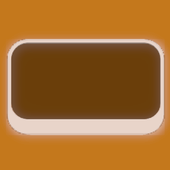
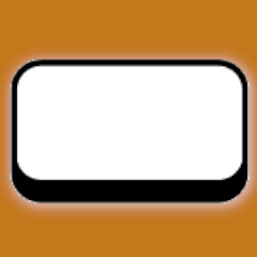
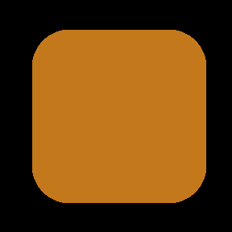
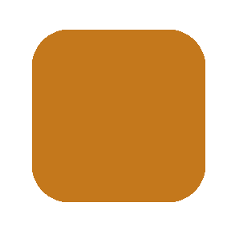

[&laquo; back](../README.md)

# Generic icons and backgrounds

A collections of [`icons`](images/icons/) and [`backgrounds`](images/backgrounds/) for use on your `Stream Deck`.

The [`backgrounds`](images/backgrounds/) images are intended to be used as backgrounds for your button text.

The [`icons`](images/icons/) images are intended to be used instead of text buttons.

> If you happen to notice that the icons in this collection all appear to be very slighty ofset to the right, you're not going crazy and you're not seeing crooked, this is intentional. For some odd reason, at least it is the case with my Stream Deck XL, the left couple of pixels are invisible/hidden. So, in order to make the icon display in the center of the button, I have had to offset everything accordingly. You can check this yourself by loading <a href="./images/icons/stream-deck-button-analyser-left.png">this icon</a> onto one of your keys to see which segments are visible, for me the markers start to become visible from 7 and above.

## Table of contents

- [Plain backgrounds](#plain-backgrounds)
- [Keyboard buttons (style 01)](#keyboard-buttons-style-01)
- [Keyboard buttons (style 02)](#keyboard-buttons-style-02)
- [Suggestions](#suggestions)

## Plain backgrounds

| Example | Filename |
| ------- | -------- |
|   | [`bg-solid-orange-c4781c.png`](./images/backgrounds/bg-solid-orange-c4781c.png) |

File format: `<prefix> - <style> - <human description> - <rgb hexadecimal> . <file extention>`

## Keyboard buttons (style 01)

| Example | Filename |
| ------- | -------- |
|   | [`btn-01-dark-orange-c4781c.png`](./images/backgrounds/btn-01-dark-orange-c4781c.png) |
|    | [`btn-01-light-orange-c4781c.png`](./images/backgrounds/btn-01-light-orange-c4781c.png) |

File format: `<prefix> - <style number> - <variant> - <human description> - <rgb hexadecimal> . <file extention>`

## Rounded square buttons (style 02)

| Example | Filename |
| ------- | -------- |
|   | [`btn-02-black-000000-orange-c4781c.png`](./images/backgrounds/btn-02-black-000000-orange-c4781c.png) |
|    | [`btn-02-white-ffffff-orange-c4781c.png`](./images/backgrounds/btn-02-white-ffffff-orange-c4781c.png) |

File format: `<prefix> - <style number> - <frame: human description> - <frame: rgb hexadecimal> - <button: human description> - <button: rgb hexadecimal> . <file extention>`

## Suggestions

Do you have a suggestion for a colour or a design? let me know! Get in touch via the <a href="https://github.com/JustaDevOnTheMove/StreamDeckProfiles/issues" target="_blank">issues tab</a> here on github or on [Reddit](https://www.reddit.com/user/JustaDevOnTheMove/).
