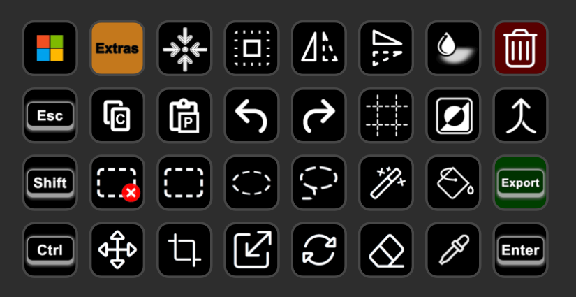
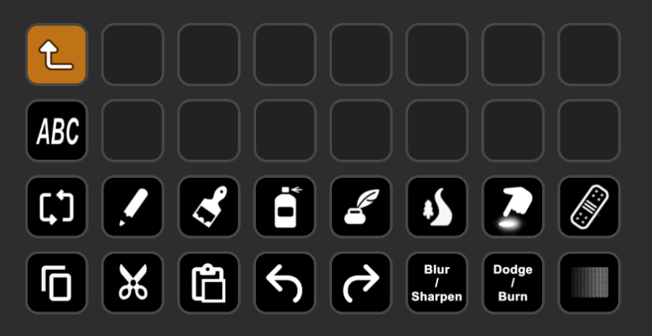

[&laquo; back](../README.md)

# Gimp

`Stream Deck XL` profile for the image manipulation program `Gimp`.

## Table of contents

- [Profile](#profile)
- [Download](#download)

## Profile

This is a simple icons only profile, meaning that there is nothing complex going on, it's simply keyboard shortcuts decorated with pretty icons.

> Note: some of the buttons require that you configure the keyboard shortcuts within Gimp as these are not set by default. You can do this by going to: `Edit` > `Keyboard Shortcuts` and then searching for the function in question and then finally, setting a key combination of your choice. (Typically, these will be buttons that I have configured with the `Shift + Alt + <somekey>` combo in the profile).

### Homepage

Currently, these are the keys that I use the most. Your use may be different, so feel free to swap out buttons from the extras folder to match your needs.

### Extras

Currently, this folder has plenty of space for more buttons, but these are all that I've needed so far. Do let me know if there are some additional icons that you would like. Also, some buttons I'm at a loss as to what I could use as an icon. As it is, there are some that at frst glance may confuse you, swap them out if necessary.

## Download

- Latest version as individual files:
    - [Latest version](v1/Gimp.streamDeckProfile)
- Latest version as a zip file:
    - [Gimp-StreamDeckProfiles-1-0-0.zip](v1/Gimp-StreamDeckProfiles-1-0-0.zip)
- Older versions as a zip file:
    - none yet
