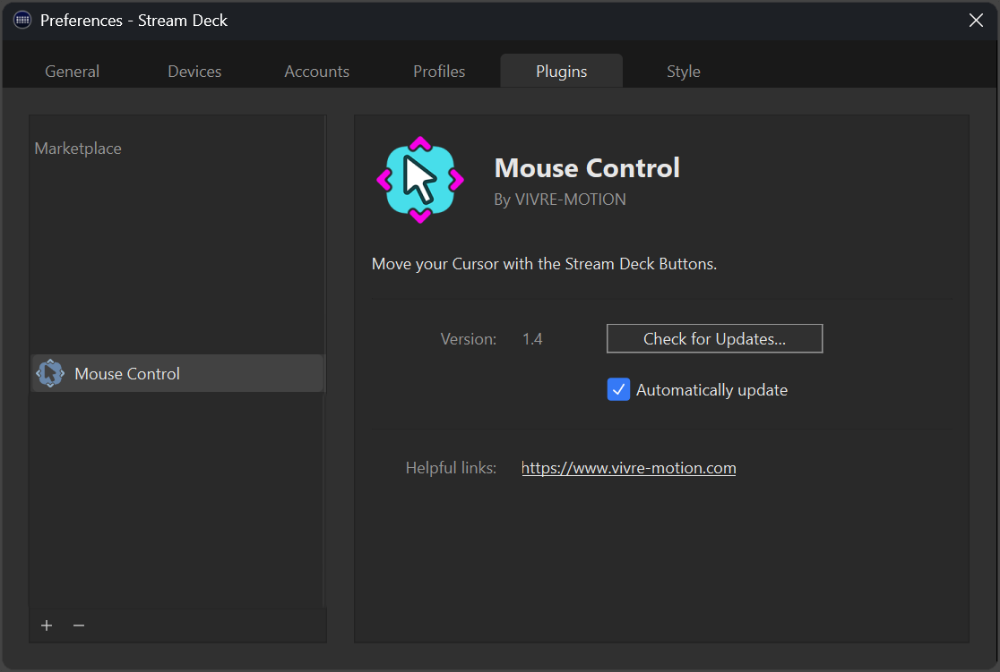
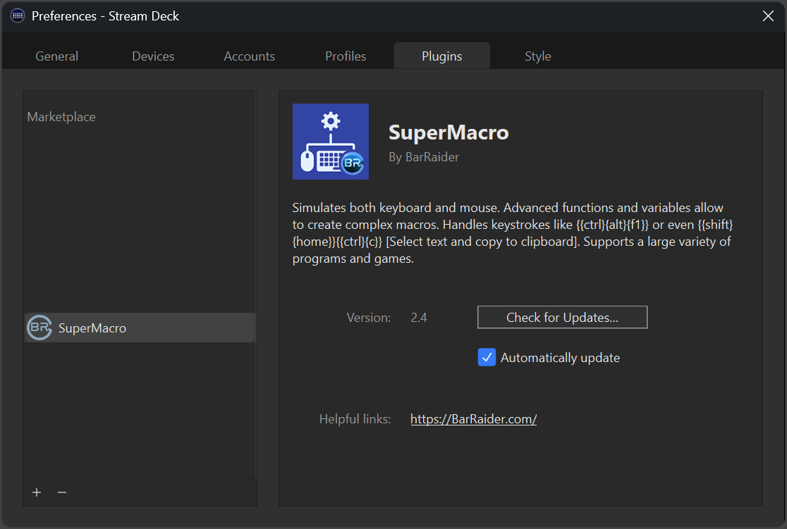
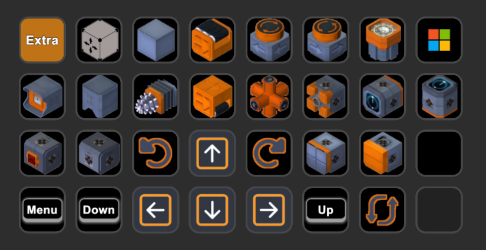
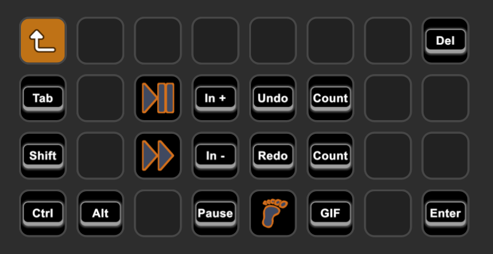

[&laquo; back](../README.md)

# Infinifactory

A `Stream Deck XL` profile for the game `Infinifactory`.

## Table of contents

- [Plugin Requirements](#plugin-requirements)
- [Profile description](#profile-description)
- [Preparing the profile for first use](#preparing-the-profile-for-first-use)
- [Download](#download)

## Plugin Requirements

You will need these two free plugins that are available from the <a href="https://marketplace.elgato.com/stream-deck" target="_blank">Elgato Plugins Marketplace</a>. Download these plugins and install them <strong>BEFORE</strong> you install the Stream Deck profile.

### <a href="https://marketplace.elgato.com/product/mouse-control-65f148e7-43e9-4be0-aacd-95b5bfce0e36" target="_blank">Mouse Control</a>

### <a href="https://marketplace.elgato.com/product/supermacro-62195fec-7bcb-403d-b650-c342e9dfec67" target="_blank">Super Macro</a>

## Profile description

### Home screen

### Extra keys

## Preparing the profile for first use

Once you have the two require plugins installed you will be able to install and use this profile. Since the various blocks don't have keybindings, I've had to simulate pressing and holding down the `Block Menu` key (default is: Shift), then moving the mouse cursor to the spacific location on the screen, then clicking the with the left mouse button, then finally, releasing the `Block Menu` key.

As such, you may find that at your specific screen resolution, you may need to adjust the coordinates for each button.

## Download

- Latest version as individual file:
    - [Latest version](v1/Infinifactory.streamDeckProfile)
- Latest version as a zip file:
    - [Infinifactory-StreamDeckProfiles-1-0-0.zip](v1/Infinifactory-StreamDeckProfiles-1-0-0.zip)
- Older versions as a zip file:
    - none yet
