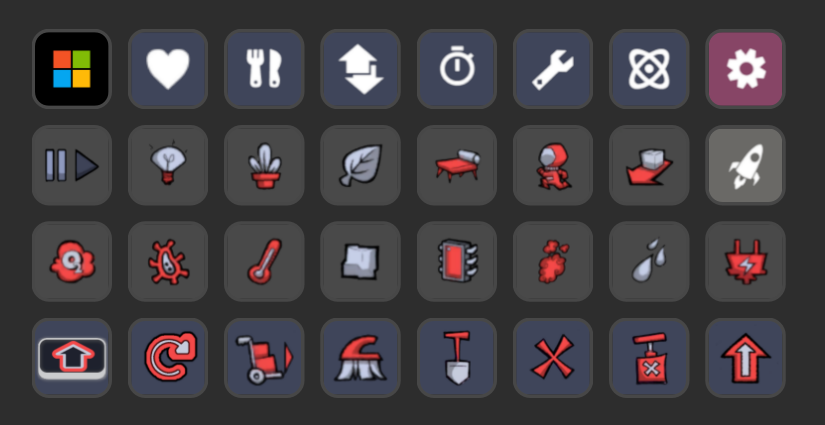

[&laquo; back](../README.md)

# Oxygen Not Included

A `Stream Deck XL` profile for the game `Oxygen Not Included`.

## Table of contents

- [Profile description](#profile-description)
- [Download](#download)

## Profile description

This is a simple icons only profile, meaning that there is nothing complex going on, it's simply keyboard shortcuts decorated with pretty icons.

As you can see in the screenshot below, the board is full and yet there are some items missing. These are the ones that I found the most useful, however, <a href="../../images/icons/">all the icons</a> that I've encountered are available should you with to implement them in your own profile. Let me know if there are any that I have missed!

## Download

- Latest version as individual file:
    - [Latest version](v1/Oxygen-Not-Included.streamDeckProfile)
- Latest version as a zip file:
    - [Oxygen-Not-Included-StreamDeckProfiles-1-0-0.zip](v1/Oxygen-Not-Included-StreamDeckProfiles-1-0-0.zip)
- Older versions as a zip file:
    - none yet
