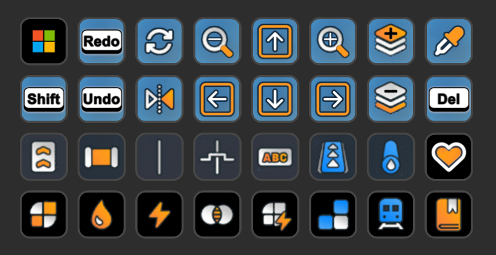
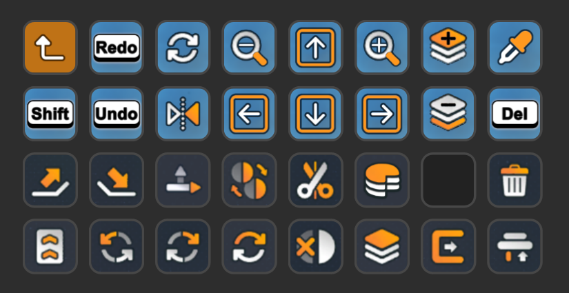
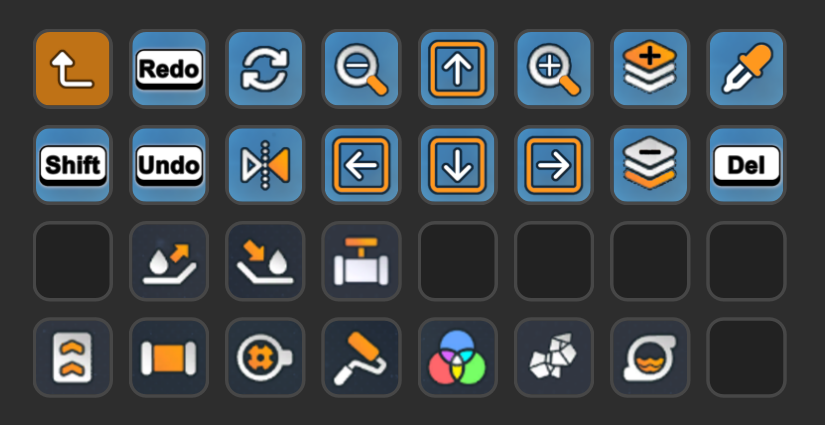
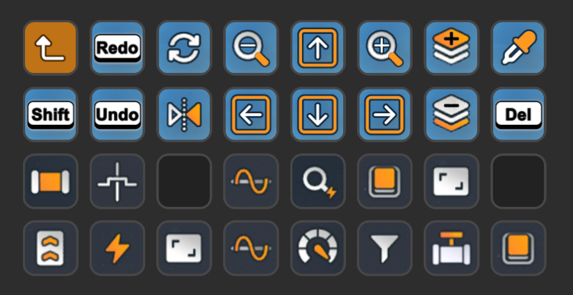
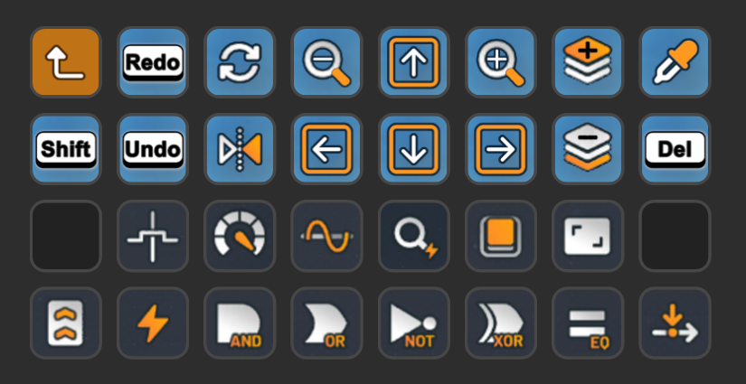
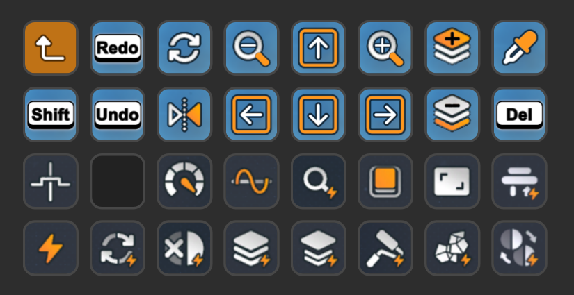
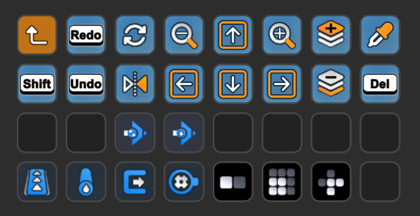
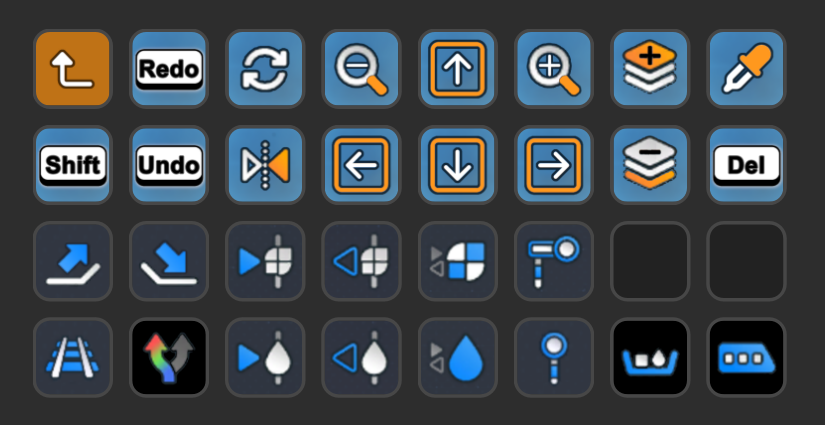
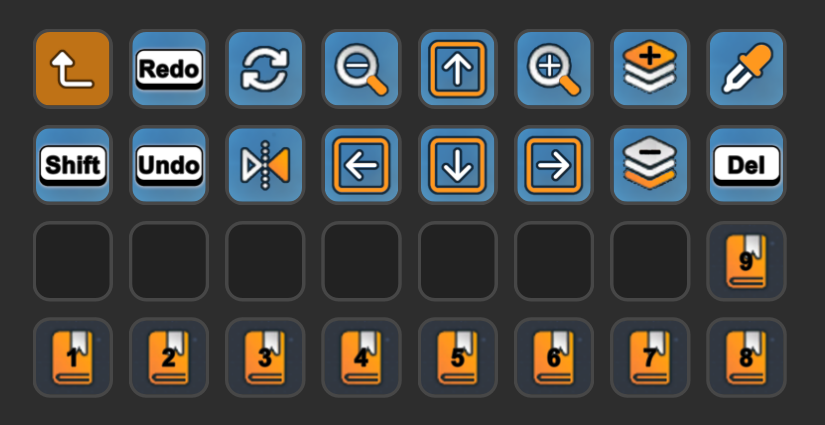
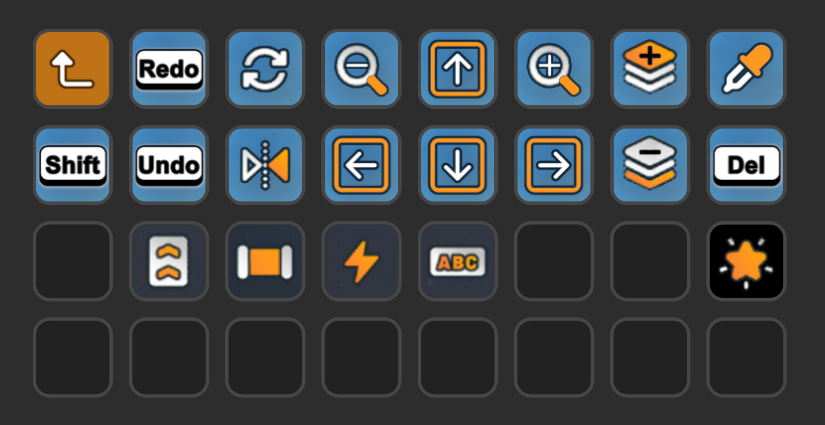

[&laquo; back](../README.md)

# Shapez2

A `Stream Deck XL` profile for the game `Shapez2`.

## Table of contents

- [About](#about)
- [Profile description](#profile-description)
- [Download](#download)

## About

### Design philosophy

These screens have been designed and organised slightly different from the in-game menu to try to make functionality available in less steps.

The goal was to also remove the need to use the keyboard leaving you with one hand on the mouse and the other on the Stream Deck.

### The meaning of colours

 Buttons on a sky blue background are persistent navigation buttons (example: up, down, left, right, rotate, flip, etc...)

 Buttons on a black background are menu (folder) buttons buttons that reveal additional buttons when pressed. These are generally used when there are too many items to fit on the existing screen.

 These orange buttons are to exit the current sub folder menu.

 Buttons on a slate gray background are tool item buttons (example: belt, pipe, wire, etc...)

## Profile description

### Default homepage

### Shapes

### Fluids

### Electronics

### Logic

### Simulation

### Space

### Trains

### Blueprints

### Favourites

This folder is totally optional and is intended to allow you to place here up to 16 of your current most used items. Fill it with whatever you want or delete the folder entirely, it's up to you.

## Download

- Latest version as individual file:
    - [Latest version](v1/Shapez2.streamDeckProfile)
- Latest version as a zip file:
    - [Shapez2-StreamDeckProfiles-1-0-0.zip](v1/Shapez2-StreamDeckProfiles-1-0-0.zip)
- Older versions as a zip file:
    - none yet
