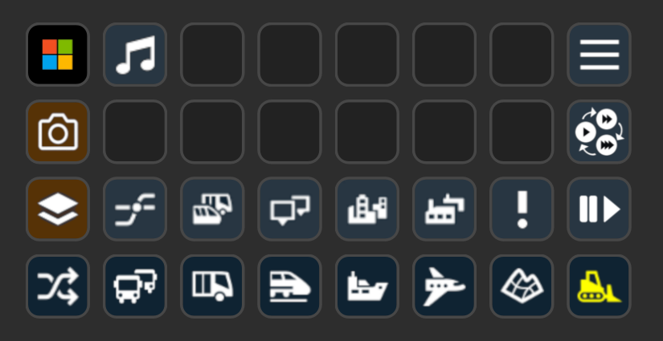

[&laquo; back](../README.md)

# Transport Fever 2

`Stream Deck XL` profiles for the game `Transport Fever 2`.

## Table of contents

- [Profiles](#profiles)
    <table>
        <tr>
            <td><a href="#style-01">Style 01</a></td>
            <td></td>
        </tr>
        <tr>
            <td><a href="#style-02">Style 02</a></td>
            <td></td>
        </tr>
    </table>
- [Download](#download)

## Profiles

This is a simple icons only profile, meaning that there is nothing complex going on, it's simply keyboard shortcuts decorated with pretty icons.

> Note: a significant number of the keys in `Transport Fever 2` are unmapped by default, so for some of the keys in these profiles to work, you'll need to edit the game settings to map these if you want to use them. For example, all the `Layer` keys are unmapped by default.

I've created 2 icon styles, both icon sets are available in the <a href="../../images/icons/">`icons`</a> directory, so feel free to mix-and-match.

### Style 01

#### Home

#### Layers

#### FPV Camera

### Style 02

#### Layers

#### FPV Camera

## Download

- Latest version as individual file:
    - [Latest version - style 01](v1/Transport-Fever-2-01.streamDeckProfile)
    - [Latest version - style 02](v1/Transport-Fever-2-02.streamDeckProfile)
- Latest version as a zip file:
    - [Transport-Fever-2-StreamDeckProfiles-1-1-0.zip](v1/Transport-Fever-2-StreamDeckProfiles-1-1-0.zip)
- Older versions as a zip file:
    - [Transport-Fever-2-StreamDeckProfiles-1-0-0.zip](v1/Transport-Fever-2-StreamDeckProfiles-1-0-0.zip)
